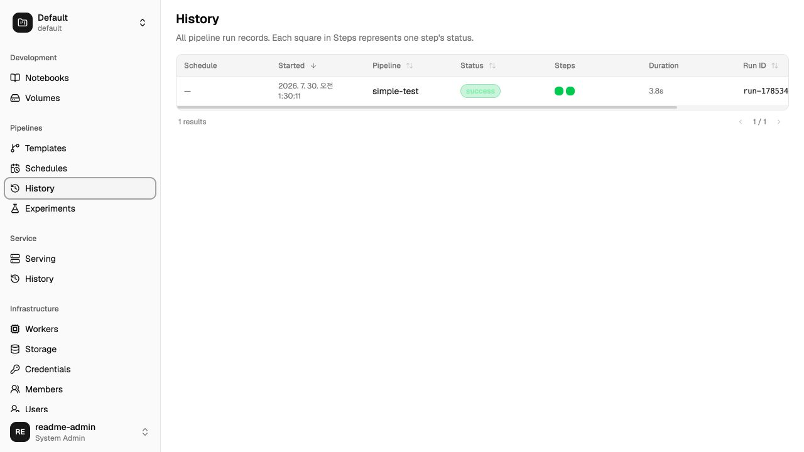

# Piper

Piper is a lightweight ML pipeline orchestrator for jobs, notebooks, and model
services. It ships as one Go binary with an embedded web UI and executes
pipeline, notebook, and serving workloads directly and in-process — there is
no separate worker process and no worker tunnel to operate.



Piper is intended for teams that have outgrown cron jobs and CI scripts but do
not need a full platform such as Kubeflow.

## What Piper provides

- DAG-based pipelines with dependencies, retries, and parallel steps
- Direct in-process execution on bare metal, Docker, or Kubernetes
- Pipeline templates, versioned snapshots, schedules, and run history
- Logs, metrics, parameters, experiments, and artifacts
- Jupyter notebook lifecycle management
- Long-running model service deployment
- Local or S3-compatible artifact storage
- Project membership, local users, and credential management
- Experimental Home/Member tunnel primitives (the production Home listener,
  project routing, delegated authorization, and federation recovery flow are
  not wired into the server yet)
- An embeddable Go API

Piper is not a feature store, distributed training framework, Kubernetes
scheduler, or full model-governance platform.

## Quick start

### Build and run from this repository

Requirements:

- Go 1.26 or newer
- Node.js 24
- pnpm

```bash
pnpm install
make build
./bin/piper server
```

Open <http://localhost:8080>. On the first visit, Piper asks you to create the
initial system administrator.

The checked-in [`config/piper.yaml`](config/piper.yaml) configures a
single-node bare-metal runtime. The server:

- reads `./config/piper.yaml`
- listens on `:8080`
- stores SQLite data and local artifacts under `./piper-data`
- generates authentication and credential-encryption keys in
  `./piper-data/.server-secrets.yaml`
- reuses those keys on subsequent starts

Stop the server with `Ctrl+C`. Back up `piper.db` and
`.server-secrets.yaml` together.

### Run a pipeline directly

`piper run` executes a pipeline directly against the configured
`runtime.type`, using the same queue and execution path as a deployed server.

```bash
./bin/piper parse examples/basics/simple.yaml
./bin/piper run examples/basics/simple.yaml
```

### Install with Go

```bash
go install github.com/loykin/piper/cmd/piper@latest
```

`runtime.type` is required — there is no config file needed for a quick trial,
but the runtime must be named through the environment when no file is
present:

```yaml
# pipeline.yaml
apiVersion: piper/v1
kind: Pipeline
metadata:
  name: hello
spec:
  steps:
    - name: hello
      run:
        command: ["echo", "hello from piper"]
```

```bash
PIPER_RUNTIME_TYPE=baremetal piper run pipeline.yaml
```

For a persistent server, create `./config/piper.yaml` or copy the repository
sample before running `piper server`. Piper never searches a home directory for
configuration.

## Architecture

```text
Browser / API client
        │
        ▼
Piper server (:8080)
  ├─ HTTP API and embedded UI
  ├─ scheduler, queue, and state
  ├─ artifact store
  └─ runtime driver (bare metal / Docker / Kubernetes)
           │
           ▼
      Pipeline subprocess, Docker container,
      or Kubernetes Job / StatefulSet / Deployment
```

The server drives its configured runtime directly — a subprocess supervisor,
the Docker daemon, or the in-cluster Kubernetes API — with no intermediate
worker process and no outbound worker tunnel. `server.http_addr` serves the
HTTP API and embedded UI only.

Pipeline subprocesses, containers, and Kubernetes workload Pods do not open
their own control-plane connection back to the server. Artifact storage is
the exception: a workload may access the configured artifact endpoint
directly (`storage.url`, or Piper's own `/store` endpoint via
`runtime.workload_url` when the built-in file store is used).

## Configuration

The default path is project-relative:

```text
./config/piper.yaml
```

Use another file explicitly when needed:

```bash
piper --config ./deploy/docker/piper.yaml config validate
piper --config ./deploy/docker/piper.yaml config show
piper --config ./deploy/docker/piper.yaml server
```

Environment variables override file values. Names are derived from YAML paths:

```text
server.http_addr              → PIPER_SERVER_HTTP_ADDR
server.auth_signing_key       → PIPER_SERVER_AUTH_SIGNING_KEY
server.secret_encryption_key  → PIPER_SERVER_SECRET_ENCRYPTION_KEY
storage.url                   → PIPER_STORAGE_URL
runtime.type                  → PIPER_RUNTIME_TYPE
```

`config show` redacts secrets. `config validate` checks the effective
server configuration.

### Server settings

The full commented reference is
[`config/piper.yaml`](config/piper.yaml). A minimal single-node server is:

```yaml
version: 4

server:
  http_addr: ":8080"
  data_dir: ./piper-data
  db:
    driver: sqlite
    path: ./piper-data/piper.db

runtime:
  type: baremetal
  baremetal:
    meta_dir: ./piper-data/pipeline-meta
    concurrency: 4
```

Address, TLS, database, runtime, concurrency, retention, and scheduling
belong in configuration. The `server` command intentionally has no operational
flags.

If `server.auth_signing_key` and `server.secret_encryption_key` are omitted,
Piper generates both in `server.data_dir/.server-secrets.yaml` with owner-only
permissions. Explicit configuration or environment values take precedence.

For production:

- keep generated keys on persistent storage or inject them from a secret manager
- set `server.workload_token` when Kubernetes pods or Docker containers reach
  back into Piper's own built-in artifact store over `/store`
- terminate TLS at Piper or a trusted ingress/reverse proxy
- back up the database, artifact storage, and encryption keys together
- use PostgreSQL and an appropriate availability design before adding server
  replicas

### Runtime settings

`runtime.type` selects exactly one execution backend for pipeline, notebook,
and serving workloads. Pick one:

```yaml
# Bare metal — subprocesses on the Piper host.
runtime:
  type: baremetal
  baremetal:
    meta_dir: ./piper-data/pipeline-meta
    concurrency: 4

# Docker — containers on the Piper host.
runtime:
  type: docker
  docker:
    network: bridge
    concurrency: 4
    # Required with the built-in file store; containers use this private URL.
    workload_url: http://host.docker.internal:8080

# Kubernetes — Pipeline runs as Jobs, Notebook as StatefulSets, Serving as
# Deployments, all in the configured namespaces.
runtime:
  type: k8s
  namespaces: [piper]
  kubeconfig: ""     # required only outside the cluster
  in_cluster: true
  # Required with the built-in file store; pods use this private URL.
  workload_url: http://piper-server.piper.svc.cluster.local:8080
  pipeline_runner:
    image: ghcr.io/loykin/piper:latest
    image_pull_policy: IfNotPresent
```

Rules:

- workload images, namespaces, resources, and Pod templates belong to
  submitted Pipeline, Notebook, or ModelService manifests, not to
  `runtime.*` — `runtime.namespaces` (k8s) is an allowlist, not a workload
  default
- a Docker pipeline step runs by bind-mounting Piper's own running binary
  (`os.Executable()`) into the step's container and executing it there as
  `piper agent exec`. That only works if the Piper process itself is a Linux
  binary — on a non-Linux host (macOS, Windows), run Piper inside a Linux
  container using a cross-compiled `bin/piper-arm64` / `bin/piper-amd64` from
  `make build-linux-arm64` / `make build-linux`, not the host-native
  `piper` binary. For example, on Apple Silicon:

```bash
make build-linux-arm64
docker run -d --name piper \
  --add-host host.docker.internal:host-gateway \
  -v /var/run/docker.sock:/var/run/docker.sock \
  -v "$PWD/bin/piper-arm64:$PWD/bin/piper-arm64:ro" \
  -v "$PWD/config:$PWD/config" \
  --entrypoint "$PWD/bin/piper-arm64" \
  -p 8080:8080 \
  alpine:3.20 --config "$PWD/config/piper.yaml" server
```

Running the host-native binary directly still starts the server, but every
dispatched Docker step fails immediately (the container exits without ever
writing a result file, since the mounted binary can't execute inside the
step's Linux container) — the error and exit code depend on the step image's
init/shell, but none of them produce a working step.

Notebook and serving direct-runtime placement follows the same rule:
`placement.worker` and `placement.label` are rejected outright (there is
nothing to route to besides this installation's own configured runtime).
`placement.runtime` may be left empty or set to match `runtime.type`; any
other value fails validation before dispatch.

## Pipeline manifests

```yaml
apiVersion: piper/v1
kind: Pipeline

metadata:
  name: training

spec:
  defaults:
    driver:
      placement:
        runtime: k8s
      k8s:
        image: python:3.12-slim
        namespace: piper

  steps:
    - name: extract
      run:
        command: ["sh", "-c", "echo data > $PIPER_OUTPUT_DIR/data.txt"]
      outputs:
        - name: raw
          path: data.txt

    - name: train
      depends_on: [extract]
      run:
        command: ["python", "train.py"]
      inputs:
        - name: raw
          from: extract/raw
      outputs:
        - name: model
          path: model
      driver:
        k8s:
          resources:
            cpu: "4"
            memory: "16Gi"
            gpu: "1"
```

`driver.placement.runtime` is optional and, if set, must match this
installation's configured `runtime.type` — Piper does not route a run across
multiple runtimes. Pipeline defaults may set placement for the entire run;
individual steps may override it (to the same runtime only).

Piper injects:

| Variable | Meaning |
|---|---|
| `PIPER_OUTPUT_DIR` | Current step output directory |
| `PIPER_INPUT_DIR` | Root containing materialized inputs |
| `PIPER_RUN_ID` | Current run ID |
| `PIPER_STEP_NAME` | Current step name |

More examples are available under [`examples`](examples).

## Artifact storage

Artifact storage is independent of execution mode.

With no explicit `storage.url`, Piper uses its built-in file store under
`server.data_dir`. Baremetal subprocesses share the host filesystem directly
and read it as a local path. Docker containers and Kubernetes pods cannot
reach the host filesystem, so they receive the server's authenticated
`/store` URL (`runtime.workload_url` / `runtime.docker.workload_url`) and
transfer artifacts over HTTP instead.

For larger distributed or production deployments, configure an S3-compatible
backend:

```yaml
storage:
  url: "s3://piper-artifacts?region=us-east-1"
  credentialRef: artifact-store
```

Credentials can also be supplied through the storage URL, `storage.token`, or
environment variables. Avoid committing secret values.

Typical artifact keys are:

```text
{runID}/{stepName}/{artifactName}/...
```

S3 is recommended when:

- Docker or Kubernetes workloads need high-throughput direct artifact access
- artifacts must outlive a server volume
- multiple control-plane instances share storage

## Model serving

A ModelService can deploy an artifact produced by a pipeline:

```yaml
apiVersion: piper/v1
kind: ModelService

metadata:
  name: fraud-detector

spec:
  model:
    from_artifact:
      pipeline: training
      step: train
      artifact: model
      run: latest

  run:
    command:
      - tritonserver
      - --model-repository=$PIPER_MODEL_DIR
    port: 8000
    health_path: /v2/health/ready

  driver:
    placement:
      runtime: k8s
    k8s:
      image: nvcr.io/nvidia/tritonserver:24.01-py3
      namespace: piper
      replicas: 1
      resources:
        cpu: "2"
        memory: "8Gi"
        gpu: "1"
```

Piper expands `$PIPER_MODEL_DIR`, `${PIPER_MODEL_DIR}`, and
`$(PIPER_MODEL_DIR)` in command arguments.

For stored pipeline artifacts:

- a bare-metal serving process receives a local model directory directly
- a Docker serving container receives the artifact via its normal storage path
- a Kubernetes serving Pod uses an init container and mounts the model at
  `/piper/model`

### External model URIs

Use `from_uri` for a model that is not a Piper pipeline artifact:

```yaml
spec:
  model:
    from_uri: s3://models/fraud-detector/v12
```

| URI | Behavior |
|---|---|
| `file:///models/v12` | Rejected — a Docker container or Kubernetes pod must not assume access to a server-local path |
| `s3://bucket/key` | Passed as a remotely accessible URI |
| `http://...` or `https://...` | Passed as a remotely accessible URI |

Use `from_artifact` for artifacts managed by Piper. It works with the
built-in store as well as S3 because Piper resolves the artifact to wherever
the runtime can actually read it before launch. Do not use a scheme-less
local path in a portable ModelService manifest.

Piper also injects `PIPER_SERVICE_NAME` into serving workloads.

### Deploy automatically after a successful run

```yaml
spec:
  steps:
    - name: train
      # ...
      outputs:
        - name: model
          path: model
  on_success:
    deploy:
      service: fraud-detector
      artifact: train/model
```

The ModelService must already exist so Piper can reuse its stored deployment
manifest.

## Notebooks

Notebook manifests select the same runtime model as pipelines and services:

```yaml
apiVersion: piper/v1
kind: Notebook

metadata:
  name: research

spec:
  volume:
    size: 20Gi
    storage_class: standard

  driver:
    placement:
      runtime: k8s
    k8s:
      image: jupyter/scipy-notebook:latest
      namespace: piper
      resources:
        cpu: "2"
        memory: "8Gi"
        gpu: "1"
```

Bare-metal notebooks require JupyterLab on the Piper host. Docker notebooks
use `driver.docker.image`. Kubernetes notebooks are launched directly through
the in-cluster API — the server needs `runtime.k8s.in_cluster` (or a
`kubeconfig` outside the cluster), not a separate worker.

## Docker deployment

The Compose deployment runs a persistent single-node server with a direct
in-process runtime:

```bash
docker compose -f deploy/docker-compose.yaml up -d
docker compose -f deploy/docker-compose.yaml logs -f piper
curl http://localhost:8080/health
```

The `piper-data` volume preserves SQLite data, local artifacts, notebooks, and
generated server keys.

Use a locally built image:

```bash
make docker
PIPER_IMAGE=piper/piper:latest \
  docker compose -f deploy/docker-compose.yaml up -d
```

Equivalent one-container deployment:

```bash
docker volume create piper-data
docker run --name piper --restart unless-stopped -p 8080:8080 \
  -v ./deploy/docker/piper.yaml:/etc/piper/piper.yaml:ro \
  -v piper-data:/var/lib/piper \
  ghcr.io/loykin/piper:latest \
  --config=/etc/piper/piper.yaml server
```

## Kubernetes deployment

The checked-in Kustomize deployment creates:

- one Piper server that launches and reconciles pipeline Jobs, notebook
  StatefulSets, and serving Deployments directly through the in-cluster API
- RBAC, Services, and persistent volumes
- a generated ConfigMap sourced from
  [`deploy/k8s/piper.yaml`](deploy/k8s/piper.yaml)

Install it with:

```bash
./deploy/k8s/install.sh
kubectl -n piper port-forward service/piper-server 8080:8080
```

The installer creates `piper-server-secrets` once and preserves it on later
runs. It contains the authentication signing key, credential-encryption key,
and the `workload_token` shared secret that guards Piper's built-in `/store`
endpoint.

The base deployment uses the built-in artifact store. For production, configure
an S3-compatible store with
[`deploy/k8s/storage-secret.example.yaml`](deploy/k8s/storage-secret.example.yaml).
[`deploy/k8s/seaweedfs.yaml`](deploy/k8s/seaweedfs.yaml) provides an optional
development S3 gateway.

The included Service is cluster-internal. Expose it through a TLS-enabled
Ingress or load balancer. See
[`deploy/k8s/README.md`](deploy/k8s/README.md) for image pinning, secrets,
storage, and backup guidance.

For local cluster validation with Docker and kind:

```bash
make docker
kind load docker-image piper/piper:latest
```

Before installing, change the server image in `server.yaml`, and the
pipeline runner image in `piper.yaml`, along with their pull policies, to use
the image loaded into kind. Then run `./deploy/k8s/install.sh`. The same
immutable image should be used for the server and the pipeline runner init
container.

## CLI

```text
piper config validate          Validate effective server configuration
piper config show              Print redacted effective configuration
piper parse pipeline.yaml      Validate a pipeline manifest
piper run pipeline.yaml        Run a pipeline locally
piper server                   Start the API and UI
piper user                     Manage local users
piper manifest migrate         Find/fix stored manifests with a removed placement.worker/label field
```

The configuration file is the only global operational option:

```text
--config string   config file (default: ./config/piper.yaml)
```

## HTTP API

Project-scoped endpoints use `/api/projects/{project_id}`:

```text
POST   /api/projects/{project_id}/runs
GET    /api/projects/{project_id}/runs
GET    /api/projects/{project_id}/runs/{run_id}

GET    /api/projects/{project_id}/services
POST   /api/projects/{project_id}/services
GET    /api/projects/{project_id}/services/{name}
DELETE /api/projects/{project_id}/services/{name}
POST   /api/projects/{project_id}/services/{name}/restart

GET    /api/settings
GET    /health
```

See [`docs/openapi.yaml`](docs/openapi.yaml) for the API definition.

## Embedding Piper in Go

```go
package main

import (
    "context"

    piper "github.com/loykin/piper"
)

func main() {
    ctx := context.Background()

    p, err := piper.New(piper.Config{
        DBPath:    "./piper.db",
        OutputDir: "./outputs",
        Server:    piper.ServerConfig{Addr: ":8080"},
        Auth:      piper.AuthConfig{Trusted: true},
        Runtime: piper.RuntimeConfig{
            Type: piper.RuntimeBaremetal,
            Baremetal: piper.BaremetalRuntimeConfig{
                MetaDir:     "./piper-meta",
                Concurrency: 4,
            },
        },
    })
    if err != nil {
        panic(err)
    }
    defer p.Close()

    _ = ctx
}
```

Key APIs:

```go
result, err := p.Run(ctx, pipelineYAML)
err = p.Serve(ctx, piper.ServeOption{})
handler := p.HandlerContext(ctx, nil)
service, err := p.DeployService(ctx, "default", modelServiceYAML)
err = p.StopService(ctx, "default", service.Name)
```

The UI can be mounted separately with `github.com/loykin/piper/pkg/ui`.

## Development

```bash
# Build the UI and binary
pnpm install
make build

# Unit tests
make test

# Hermetic in-process E2E tests
make test-e2e

# Frontend E2E tests
make test-frontend-e2e

# Runtime-specific tests
make test-notebook-conformance
make test-docker-notebook-e2e
make test-k8s-e2e
```

`make test-k8s-e2e` requires a Kubernetes cluster and an accessible Piper image.
The Docker notebook E2E requires its configured notebook image locally.

## Repository layout

```text
cmd/piper/                 CLI commands and configuration loader
frontend/                  React web application
internal/directruntime/    Shared docker/baremetal direct-runtime execution
internal/k8sruntime/       Direct in-cluster Kubernetes lifecycle components
internal/membertunnel/     Home/Member federation tunnel (fed.md §13.4)
internal/pipelinedispatch/ Queue execution backends (k8s, docker, baremetal)
internal/queue/            Dispatch, retry, lease, and idempotency
internal/store/            SQLite and PostgreSQL repositories
pkg/pipeline/              Pipeline parsing and execution
pkg/notebook/              Notebook lifecycle and direct-runtime drivers
pkg/serving/               Model service lifecycle and direct-runtime drivers
pkg/storage/               Local, HTTP, and S3-compatible artifact storage
pkg/template/              Versioned pipeline templates
pkg/ui/                    Embedded production UI
config/                    Commented server configuration examples
deploy/                    Docker Compose and Kubernetes manifests
examples/                  Runnable workload examples
```
